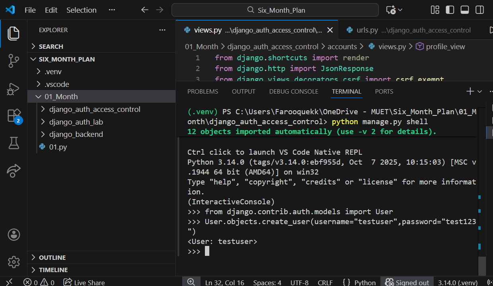
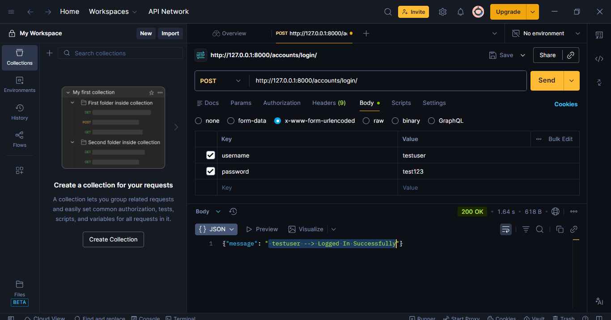
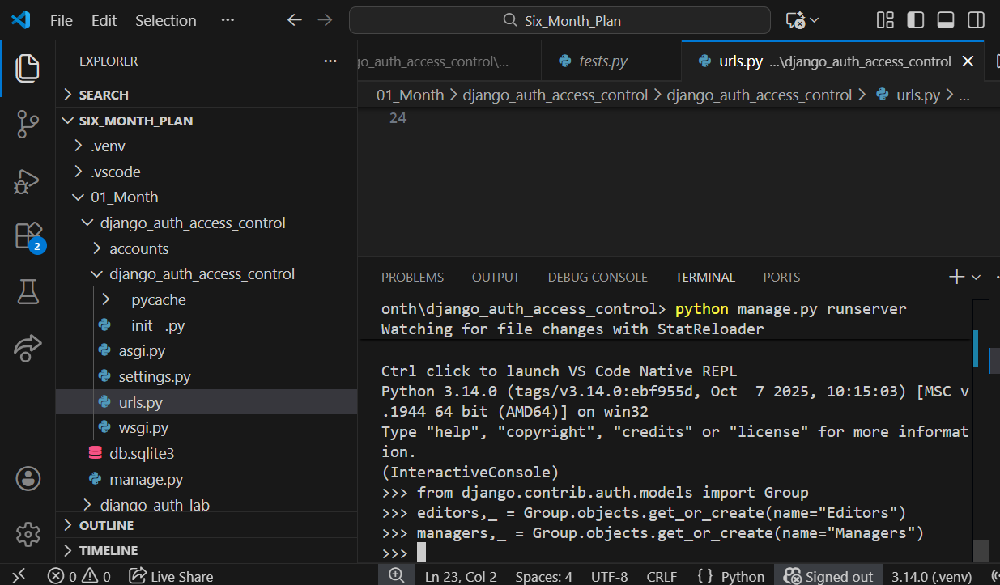
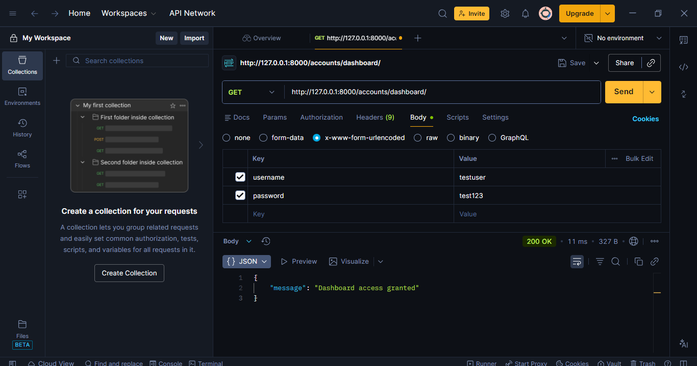
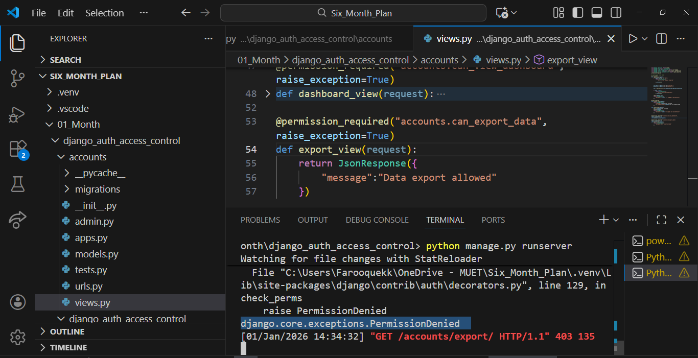
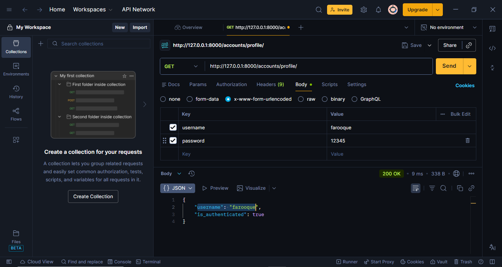
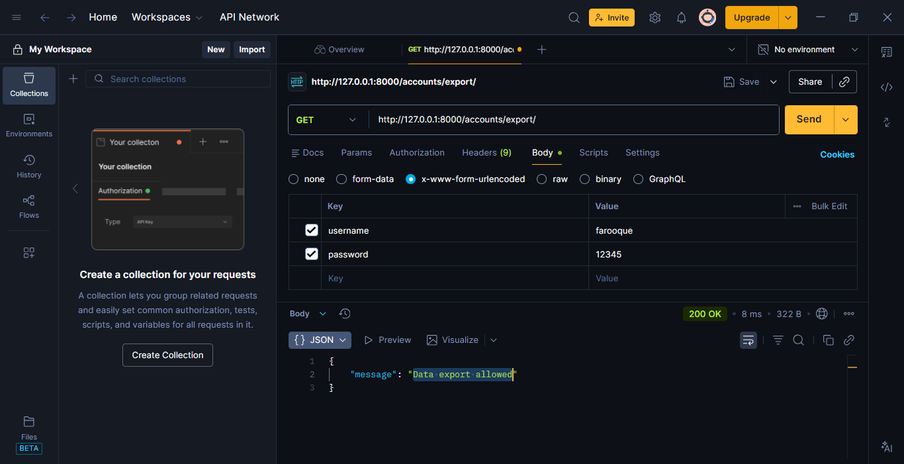

---

# Django Authentication & Authorization (Practice Project)

This project is a **practice Django backend project** created to revise and solidify core concepts of:

* Django authentication
* Sessions
* Users, groups, and permissions
* Access control using decorators
* Testing APIs using Django shell and Postman

There is **no frontend**. All functionality is tested through **Postman** and **Django shell**, and screenshots are included for reference.

---

## Purpose of This Project

Before moving to Django REST Framework, this project was created to:

* Revisit Django fundamentals
* Clearly understand how auth works internally
* Practice permissions and role-based access

---

## Tech Used

* Python
* Django
* SQLite (default Django DB)
* Postman

---

## Project Structure (Relevant)

```
django_auth_access_control/
├── accounts/
├── django_auth_access_control/
├── screenshots/
│   ├── 01_phase02_shell_create_user.png
│   ├── 02_phase02_postman_login.png
│   ├── 03_phase02_postman_profile.png
│   ├── 04_phase02_postman_logout.png
│   ├── 05_phase03_shell_create_groups.png
│   ├── 06_phase03_postman_dashboard_granted.png
│   ├── 07_phase03_terminal_permission_error_for_data_export_view.png
│   ├── 08_phase03_postman_login_super_user.png
│   ├── 09_phase03_postman_profile_super_user.png
│   ├── 10_phase03_postman_dashboard_granted_super_user.png
│   └── 11_phase03_postman_data_export_granted_super_user.png
├── manage.py
└── README.md
```

---

## Phase 02 - Authentication (Login / Logout)

### What was done

* Created users using Django shell
* Implemented login using `authenticate` and `login`
* Used session-based authentication
* Protected profile endpoint using `login_required`
* Implemented logout

---

### Evidence

**Creating user in Django shell**



---

**Login request using Postman**



---

**Accessing protected profile endpoint**


---

**Logout request**


---

## Phase 03 - Authorization (Groups & Permissions)

### What was done

* Created user groups using Django shell
* Assigned permissions to groups
* Restricted views using:

  * `has_perm`
  * `@permission_required`
* Tested access for:

  * Normal user
  * Privileged user
  * Superuser

---

### Group & Permission Creation

**Creating groups and assigning permissions in shell**



---

### Normal User Access

**Dashboard access allowed**



---

**Data export access denied (permission error)**



This confirms permissions are enforced at the backend level.

---

### Superuser Access

**Superuser login**


---

**Superuser profile**



---

**Dashboard access granted**


---

**Data export access granted**



---

## What This Project Covers Clearly

* Difference between authentication and authorization
* Why Django auth tables exist by default
* How permissions actually work (not just theory)
* How Django handles unauthorized access
* How superusers bypass permission checks
* How to test backend APIs properly

---

## How to Run

```bash
python -m venv venv
venv\Scripts\activate
pip install django
python manage.py migrate
python manage.py createsuperuser
python manage.py runserver
```

---

## Notes

* This project is intentionally simple
* No frontend
* No DRF yet
* Focus is on correctness and understanding

---

## Next Step

The next step after this project is **Django REST Framework**, starting with:

* Serializers
* APIViews / ViewSets
* Token-based authentication

---


